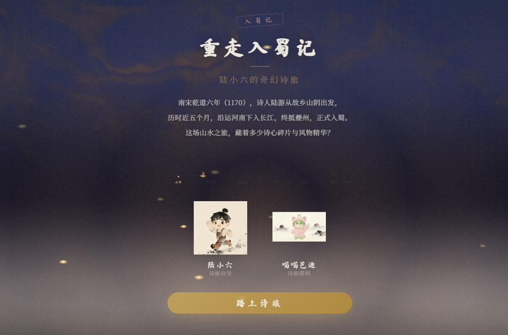

## Preview

# 重走入蜀记

一个基于陆游《入蜀记》的 interactive web 互动体验作品，融合水墨美学与古代行记，带你重走千年前的入蜀之路。

## 项目介绍

「重走入蜀记」是一款基于 Web 的互动叙事应用，以南宋诗人陆游的行记作品《入蜀记》为核心文本，融合水墨山水视觉风格，构建一场跨越千年的沉浸式旅途体验。

不同于传统诗词展示，本项目更强调“行旅与观察”：  
玩家将沿着陆游入蜀的路线，途经多个驿站，在山川与人文之间，逐步收集行记片段，参与互动内容，完成这段古代旅程的再体验。

## 功能特性

- **水墨开场动画**：基于 WebGL Shader 实现的动态水墨效果  
- **入蜀之旅**：8 个主题驿站，还原沿途风景与行旅体验  
- **角色互动**：陆小六、喵喵芭迪、狸奴等多位角色陪伴旅程  
- **行记收集**：收集《入蜀记》改编片段  
- **互动体验**：轻量化交互与内容探索（替代传统诗词问答）  
- **成就系统**：记录旅程中的关键节点  
- **背景音乐**：支持开关的氛围音乐  
- **进度保存**：自动记录用户进度  

## 开始使用

直接在浏览器中打开 `index.html` 即可开始体验。

## 界面说明

- **开场画面**：水墨动画，点击「开始旅程」进入  
- **地图视图**：查看驿站分布与当前进度  
- **驿站详情**：浏览行记内容与背景信息  
- **互动体验**：参与轻量交互内容  
- **行记集**：查看已收集内容  
- **成就**：查看解锁进度  
- **结局**：完成全部旅程后解锁  

## 技术栈

- HTML5  
- CSS3（动画、Shader 效果）  
- JavaScript（ES6+）  
- WebGL（水墨背景渲染）

## 目录结构
├── index.html # 主页面
├── css/
│ └── style.css # 样式文件
├── js/
│ ├── app.js # 主应用逻辑
│ ├── data.js # 数据定义
│ └── shader-bg.js # WebGL 水墨背景
└── assets/
├── bgm.mp3 # 背景音乐
└── characters/ # 角色立绘

## 许可证

仅供学习与交流使用。

---

# Revisiting the Journey into Shu

An interactive web experience inspired by *Lu You’s* **"Journey into Shu"**, blending classical travel writing with ink-wash aesthetics to recreate a poetic journey across ancient China.

## Project Introduction

**"Revisiting the Journey into Shu"** is a web-based interactive narrative application based on the Southern Song Dynasty writer Lu You’s travel diary *Journey into Shu*.

Combining ink-wash landscape visuals with narrative exploration, the project invites users to experience a journey through mountains, rivers, and historical waystations—retracing a thousand-year-old path through space, memory, and observation.

Players will follow Lu You’s route into Shu, visiting eight scenic waystations, collecting travel notes, engaging in interactive challenges, unlocking achievements, and gradually reconstructing this poetic journey.

## Features

- **Ink-Wash Intro Animation**: Rendered using WebGL shaders to simulate flowing ink landscapes  
- **Journey into Shu**: Eight thematic waystations inspired by Lu You’s travel records  
- **Character Interaction**: Multiple companions including Lu Xiao Liu, Miaomiao Buddy, and Linu accompany your journey  
- **Travel Notes Collection**: Collect fragments adapted from *Journey into Shu*  
- **Interactive Experience**: Light narrative-based interactions and exploration  
- **Achievement System**: Unlock milestones throughout the journey  
- **Background Music**: Toggleable ambient soundtrack  
- **Progress Saving**: Automatic progress persistence  

## Getting Started

Simply open `index.html` in your browser to begin the experience.

## Interface Overview

- **Intro Screen**: Ink-wash animation; click “Start Journey” to begin  
- **Map View**: Explore waystations and track your journey progress  
- **Waystation Details**: Discover travel notes and contextual stories  
- **Interactive Experience**: Engage with content through interactions  
- **Collection**: Review collected travel fragments  
- **Achievements**: View unlocked milestones  
- **Ending**: Complete the journey to unlock the final narrative  

## Technology Stack

- HTML5  
- CSS3 (animations, shader effects)  
- JavaScript (ES6+)  
- WebGL (ink-wash rendering)

## Directory Structure
├── index.html # Main page
├── css/
│ └── style.css # Stylesheet
├── js/
│ ├── app.js # Main application logic
│ ├── data.js # Data definitions
│ └── shader-bg.js # WebGL ink-wash background
└── assets/
├── bgm.mp3 # Background music
└── characters/ # Character illustrations
